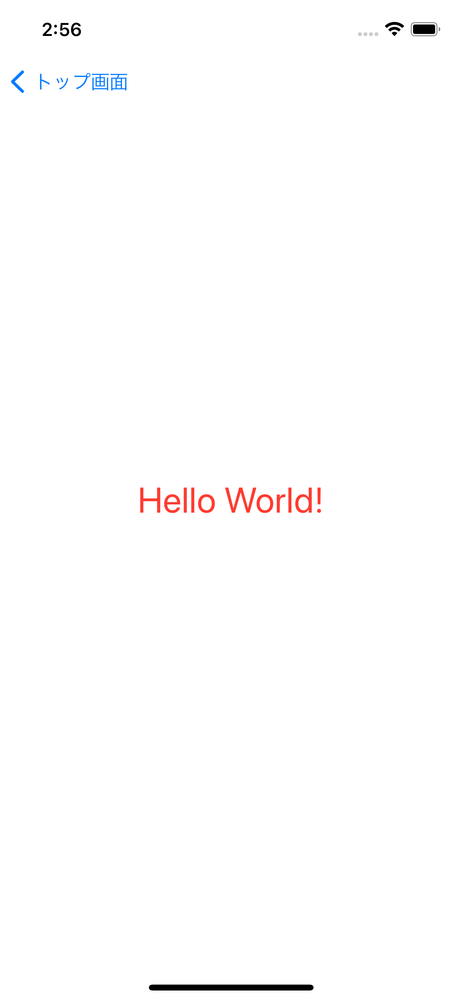

# Chapter0課題

初期画面

## TODO1: StoryboardにUILabel(部品)を設置しよう
Storyboardには様々な部品を設置することができます。

設置するためには図の矢印の「＋」を押すか、キーボードで「shift + command + l」を押すことで、設置できる部品を一覧で表示することができるのでそこから選択して設置します。

【やること】
* ChapterZero.storyboardに`UILabel`を配置しましょう

※ 配置する場所はどこでも構いません

完成予想画面

## TODO2: UILabel(部品)をカスタマイズしよう
【やること】
* `Label`の文字を`Hello World!`に文字を変更してみましょう
* 表示される文字色を変更してみましょう
* 表示される文字フォントを太くしてみましょう

完成予想画面

ヒント

ラベルをクリックした後にユーティリティエリアを確認すると各情報を見ることができます。

そこから文字、色、フォントなどを変更することができます。

## TODO3: UILabel(部品)に制約をつけてみよう
**制約とは？** → 部品を設置する際にどこに置くかのルール。位置と大きさの2つを決める必要がある。

※ 制約用語説明

Horizontally in Container
* 水平方向(横方向)に対して中心からどれだけずらすか(0の場合は中心に配置される)

Vertically in Container
* 垂直方向(縦方向)に対して中心からどれだけずらすか(0の場合は中心に配置される)

|---■---|

* 一番近い部品に対して、上下左右どれだけ余白を取るかを数値で指定する

width
* 部品の幅

height
* 部品の高さ

※ 制約を設定した後に「Add Constraints」を押下することで制約が適用されます

【やること】
* 設置したUILabel(部品)を画面の真ん中に配置しましょう

完成予想画面

iPhone13 | iPad Pro(12.9inch)
:--: | :--:
 | 

## TODO4: UIButton(部品)を配置しよう
【やること】
* `UILabel`と同様に`UIButton`を配置しましょう
* 表示される文字を`ボタン`に変更しましょう
* 設置した`UIButton`に対して`UILabel(Hello World!)`の一番下から40px、幅160px、高さ40px、横幅中央の制約を適用しましょう

完成予想画面

## TODO5: UIButton(部品)をカスタマイズしよう(UIViewControllerで変更バージョン)
TODO2で`UILabel`の文字、文字色、フォントをStoryboard(ChapterZero.storyboard)で変更しましたが、UIViewController(ChapterZeroViewController.swift)からでも変更することができます。

* Storyboard <---> UIViewController接続方法
    1. Storyboard、UIViewControllerの画面をそれぞれ表示します(キーボードの「option」を押しながらファイルをクリックでも2画面にできます)
    
    

    2. Storyboardの`UIButton`をタップし、キーボードの`control`を押しながらUIViewControllerのクラス内にドラッグします
    

    3. 名前を設定し`Connect`を押し接続を完了させます(この部品そのものの接続をアウトレット接続と言い、接続されているかどうかはStoryboardの`UIButton`のユーティリティエリアから確認することができます)
    

【やること】
* UIViewControllerから`UIButton`の文字を`ボタンチェンジ`に変更してみましょう
* UIViewControllerから`UIButton`の文字色を変更してみましょう

※ UIViewController内の`viewDidLoad()`では画面(ここでいう`ChapterZero.storyboard`の「View」)の読み込みが完了した後に呼び出される処理になります。そのため`UIButton`の各変更も`viewDidLoad()`に記述しましょう。

`画面読み込み(ボタン生成) → 画面読み込み完了[viewDidLoad()](ボタン生成完了): ボタン文字・色変更 → 画面表示`

完成予想画面

## TODO6: UIButton(部品)をタップした時の処理を作成してみよう
TODO5でStoryboardで設置した`UIButton`そのものをUIViewControllerと接続し、文字や色を変更しましたが、タップした際の処理もアウトレット接続と同様に接続することができます。

* Storyboard <---> UIViewController接続方法
    1. アウトレット接続と同様
    2. アウトレット接続と同様
    3. ConnectionをActionに変更し、名前を設定して`Connect`を押し接続を完了させます(この部品のタップなどの処理の接続をアクション接続と言います)
    

【やること】
* Storyboardの`UILabel`をUIViewControllerにアウトレット接続してみましょう
* `UIButton`をタップした際に`UILabel`の`Hello World!`の文字を`Change Button`に変更してみましょう

完成予想画面

ボタンタップ前 | ボタンタップ後
:--: | :--:
 | 