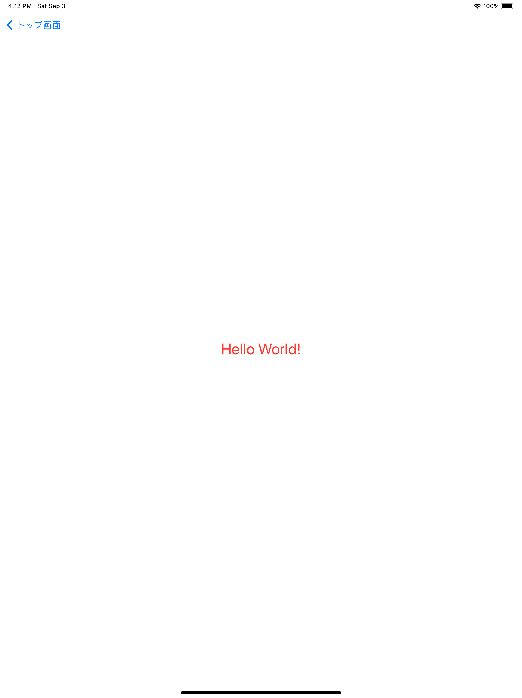

# Chapter0課題

初期画面


## 【TODO1】 StoryboardにUILabel(部品)を設置しよう
Storyboardには様々な部品を設置することができます。

設置するためには図の矢印の「＋」を押すか、キーボードで「shift + command + l」を押すことで、設置できる部品を一覧で表示することができるのでそこから表示したい部品を選択して設置できます。


今回は文字を表示するための部品である`UILabel`を取り扱います。

【やること】

- ChapterZero.storyboardに`UILabel`を配置しましょう
  - 配置する場所はどこでも構いません

※「▶︎」ボタンを押すことでSimulatorを起動(ビルド)できます(起動後トップ画面からChpater0を選択します)


完成予想画面


## 【TODO2】 UILabel(部品)をカスタマイズしよう
UILabel(部品)は表示する文字やフォント、色などをカスタマイズがすることができます。
設置したUILabelを選択しながらユーティリティエリアを見てみると、設定しているLabelの情報を確認することができます。


【やること】

- `Label`の文字を`Hello World!`に文字を変更しましょう
- 表示される文字色を赤色に変更しましょう
- 表示される文字サイズを30ptに変更しましょう

完成予想画面


## 【TODO3】 UILabel(部品)に制約をつけてみよう
【TODO1】でUILabelを設定しましたが、どこに設置するかは自由に決めたかと思います。

自由に設置しても大丈夫なのですが、小さい端末で表示した時と大きな端末で表示した時とで表示が異なっていしまいます。例えば、iPhone11では真ん中に表示したつもりでもiPhone13ではズレていることがあります。


iPhone11 | iPhone13
:--: | :--:
 | 

こういったズレを防ぐために部品をどこに設置するかのルールを決めることができます。このルールを**制約**と呼びます。制約に必要な情報は2つあり、位置と大きさになります。

※ 制約の設定方法

**Align**

Horizontally in Container
* 水平方向(X軸)の中心に配置する(数値を指定することで中心からどれだけズラすかを設定できる)

Vertically in Container
* 垂直方向(Y軸)の中心に配置する(数値を指定することで中心からどれだけズラすかを設定できる)


**Add New Constraints**

|---■---|
* 一番近い部品に対して、上下左右どれだけ余白を取るかを数値で指定する

width
* 部品の幅

height
* 部品の高さ


※ 制約を設定した後に「Add Constraints」を押下することで制約が適用されます

【やること】

- 設置したUILabel(部品)をiPhone13とiPad Pro(12.9inch)の異なる端末でも画面の真ん中になるように配置しましょう

※ 起動(ビルド)する端末(Simulator)はそれぞれ`iPhone13`、`iPad Pro(12.9inch)`を選択して確認してください。

完成予想画面

iPhone13 | iPad Pro(12.9inch)
:--: | :--:
 | 

## TODO4: UIButton(部品)を配置しよう
タップしたときに何かアクションをおこしたいといった場合には`UIButton`という部品を取り扱います。

【やること】

- `UILabel`と同様に`UIButton`を配置しましょう
- 表示される文字を`ボタン`に変更しましょう
- 背景色をオレンジ色に変更しましょう
- 設置した`UIButton`に対して制約を適用しましょう
  - 制約ルール: `UILabel(Hello World!)`の一番下から40px、横幅中央、幅160px、高さ40px

完成予想画面


## TODO5: UIButton(部品)をカスタマイズしよう(コード)
【TODO2】、【TODO4】でユーティリティエリアから部品をカスタマイズしてきましたが、こちらを使わずにコードで変更することもできます。

コードで変更するためには`ChapterZero.storyboard`と`ChapterZeroViewController.swift`を接続させる必要があります。

**UIStoryboardとUIViewControllerの接続方法(アウトレット接続)**
1. Storyboardで接続したいUIViewControllerを指定します(こちらは既に行っているので不要です)


2. 右上の「Add Editor」ボタンを押下し、接続したい画面同士の2画面にします(キーボードの「option」を押しながらファイルクリックでも2画面にすることができます)


3. `UIButton`を選択状態にし、キーボードの「control」を押しながらUIViewControllerのクラス内にドラッグします。名前は「button」と設定し「Connect」を押下することで接続が完了します

※ このUIStoryboardで配置したボタンをUIViewControllerに接続することをアウトレット接続と呼びます


【やること】

- `ChapterZero.storyboard`で設置した`UIButton`を`ChapterZeroViewController.swift`にアウトレット接続させましょう
- アウトレット接続した`UIButton`を使用してコード上でボタンの文字を`ボタンチェンジ`に変更しましょう
- アウトレット接続した`UIButton`を使用してコード上の文字色を黒色に変更しましょう

※ `ChapterZeroViewController.swift`内の`viewDidLoad()`では画面の読み込みが完了した後に呼び出される処理になります。そのため`UIButton`の変更も`viewDidLoad()`に記述しましょう

`画面読み込み(ボタン生成) → 画面読み込み完了[viewDidLoad()](ボタン生成完了): ボタン文字・色変更 → 画面表示`のような流れになります

<details>

<summary>ヒント</summary>

```swift
final class ChapterZeroViewController: UIViewController {
    @IBOutlet var button: UIButton!

    override func viewDidLoad() {
        super.viewDidLoad()

        button.setTitle(ここに表示したい文字を指定, for: .normal)
        button.setTitleColor(ここに表示したい色を指定, for: .normal)
    }
}
```

</details>

完成予想画面


## TODO6: UIButton(部品)のタップ処理を作成しよう
【TODO5】で`UIButton`のアウトレット接続を行いましたが、タップや長押しなどの操作ができる部品にはアクション接続と呼ばれる別の接続を行うことができます。このアクション接続をした中に処理を記述することで、タップをされた時などに処理を行うことができます。

**UIStoryboardとUIViewControllerの接続方法(アクション接続)**
1. アウトレット接続と同様
2. アウトレット接続と同様
3. アウトレット接続と同様に接続画面までいきます。設定する際に、Connectionを「Action」に変更し、名前を「tappedButton」と設定して`Connect`を押し接続を完了させます


【やること】
- `ChapterZero.storyboard`で設置した`UILabel`を`ChapterZeroViewController.swift`にアウトレット接続させましょう(名前は「label」として設定してください)
- `ChapterZero.storyboard`で設置した`UIButton`を`ChapterZeroViewController.swift`にアクション接続させましょう
- ボタンをタップした際に「Hello World!」の文字が表示されている`UILabel`を「Goodbye World!」に変更しましょう

<details>

<summary>ヒント</summary>

```swift
@IBAction func tappedButton(_ sender: Any) {
    label.text = 表示したい文字
}
```

</details>

完成予想画面

ボタンタップ前 | ボタンタップ後
:--: | :--:
 | 