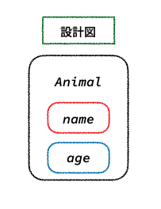
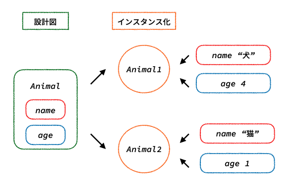
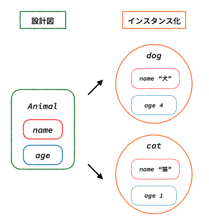
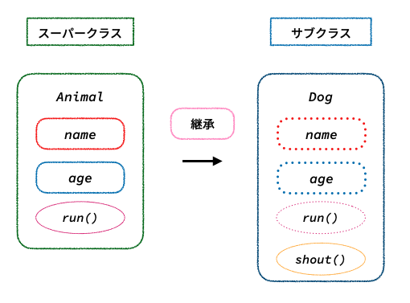

# Chapter0チュートリアル

## 覚えておきたいキーワード

### class
「class」とは設計図のようなもので、設計図の中には必要な情報や処理などを書くことができます。

下記は「Animal」という名前で「name」と「age」という情報を持っている設計図を作成しています。

```swift
class Animal {
    var name: String?
    var age: Int?
}
```



実際にこの設計図を使って、製品を作ることを「インスタンス化(実体化)」と呼びます。

下記はAnimalクラスをインスタンス化したものになります。

```swift
let animal1 = Animal() // インスタンス化
animal1.name = "犬"
animal1.age = 4

let animal2 = Animal() // インスタンス化
animal2.name = "猫"
animal2.age = 1
```



上記のanimal1とanimal2はインスタンス化した後に「name」と「age」に値を代入していますが、インスタンス化すると同時に値を代入することもできます。この処理を「イニシャライザ」と呼びます。

```swift
class Animal {
    var name: String
    var age: Int

    init(name: String, age: Int) {
        self.name = name
        self.age = age
    }
}

let dog = Animal(name: "犬", age: 4)
let cat = Animal(name: "猫", age: 1)
```



### 継承
クラス(class)には継承という考え方があり、継承するクラス(サブクラス)は継承されるクラス(スーパークラス)で定義した処理(メソッド)や情報(プロパティ)を定義せずとも使用することができます。新たに処理や情報を追加することも可能です。

継承するには以下のように宣言する必要があります。

`サブクラス名: スーパクラス名 {}`

```swift
class Animal {
    var name: String
    var age: Int

    init(name: String, age: Int) {
        self.name = name
        self.age = age
    }

    func run() {
        print("走る")
    }
}

class Dog: Animal {
    func shout() {
        print("ワンワン")
    }
}

let dog = Dog(name: "犬", age: 4)
dog.run() // 走る
dog.shout() // ワンワン
```



### オーバーライド(override)
サブクラスはスーパークラスから継承するメソッドやプロパティを再定義することができ、これを「オーバーライド(override)」と呼びます。

オーバーライドするためにはメソッドやプロパティに`override`キーワードを記述して宣言します。

``` swift
class Animal {
    var name: String?
    var age: Int?

    init(name: String?, age: Int?) {
        self.name = name
        self.age = age
    }

    func run() {
        print("走る")
    }
}

class Dog: Animal {
    override func run() {
        print("ワンワン鳴きながら走る")
    }

    func shout() {
        print("ワンワン")
    }
}

let cat = Animal(name: "猫", age: 1)
cat.run() // 走る

let dog = Dog(name: "犬", age: 4)
dog.shout() // ワンワン
dog.run() // ワンワン鳴きながら走る
```

また、オーバーライドしたメソッドやプロパティ内で`super`キーワードを使うことでスーパークラスの処理も呼び出すこともできます。

``` swift
class Dog: Animal {
    override func run() {
        super.run()
        print("いっぱい走って疲れた")
    }

    func shout() {
        print("ワンワン")
    }
}

let dog = Dog(name: "犬", age: 4)
dog.run() // 走る いっぱい走って疲れた
```

### final
`final`キーワードを記述して宣言した場合はオーバーライドされることを禁止することができます。

finalがついているものをオーバーライドしようとするとコンパイルエラーを出力します。

``` swift
class Animal {
    var name: String?
    var age: Int?

    init(name: String?, age: Int?) {
        self.name = name
        self.age = age
    }

    final func run() {
        print("走る")
    }
}

class Dog: Animal {
    override func run() { // Instance method overrides a 'final' instance method
        print("ワンワン鳴きながら走る")
    }

    func shout() {
        print("ワンワン")
    }
}
```