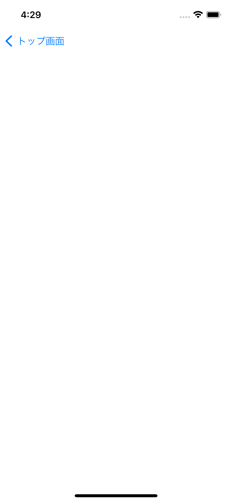
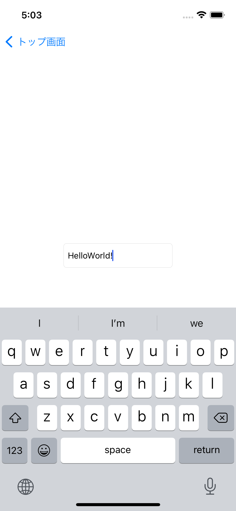
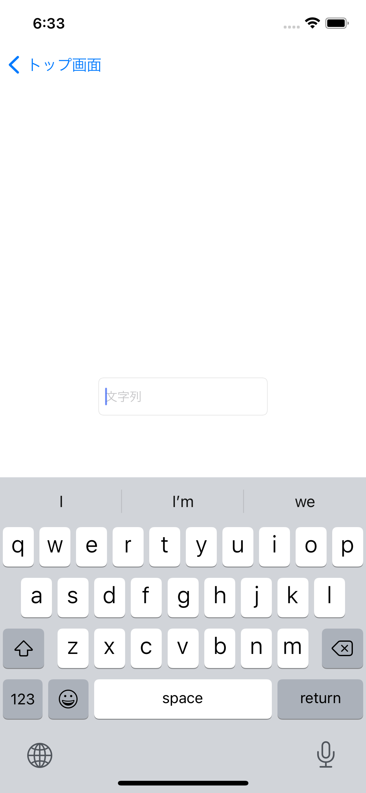
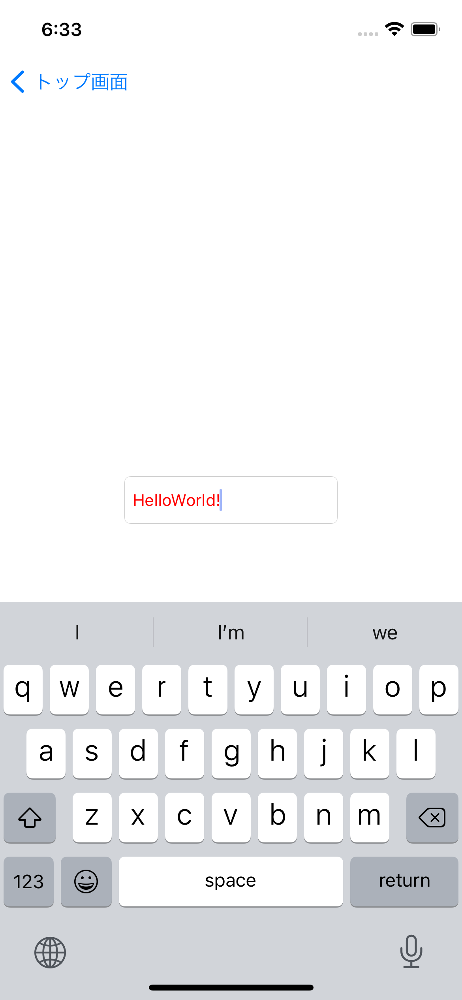
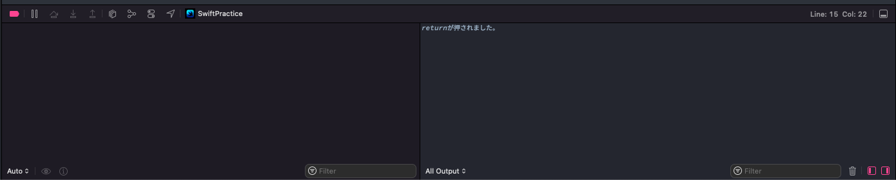

# Chapter1課題

初期画面



## TODO1: StoryboardにUITextField(部品)を配置しよう
`UITextField`とは文字列を入力する際に使用する部品です。

例えば、ユーザー登録画面でメールアドレスやパスワードをユーザーに入力してもらうために使用したりされます。

今回はこの`UITextField`について確認していきましょう。

【やること】
* ChapterOne.storyboardに`UITextField`を配置しましょう
* 配置した`UITextField`の制約は、「画面の中心かつ幅180、高さ40」で表示できるように付けてみましょう
* Simulatorで起動した後に`UITextField`に「HelloWorld!」と表示させてみましょう

※ Simulator上でキーボードは「Shift + Command + K」で表示・非表示できます(ショートカットコマンド)

完成予想図



## TODO2: UITextField(部品)をUIViewControllerでカスタマイズしてみよう
【やること】
* `ChapterOne.storyboard`に配置した`UITextField`を`ChapterOneViewController.swift`に接続してみましょう
* ChapterOneViewControllerの`viewDidLoad()`で`UITextField`のplaceHolderに「文字列」と設定してみましょう
* ChapterOneViewControllerの`viewDidLoad()`で`UITextField`の文字色を変更してみましょう

完成予想図

文字入力前 | 文字入力後
:--: | :--:
 | 

## TODO3: UITextField(部品)のイベントを検知してみよう
`UITextField`にはさまざまなイベントが用意されており、`delegate`という機能を用いてイベントを受け取った際の処理を設定することができます。(`delegate`については`Tutorial.md`の方で説明した内容を再度確認してみてください)

【やること】
* `ChapterOneViewController`に接続した`UITextField`に`delegate`を設定しましょう
* キーボードのReturnキーが押された際に呼ばれる関数を設定しましょう(関数の中に`print("returnが押されました")の処理を含めてください`)

完成予想ログ

Returnキーを押した時に出力されるログ



<details>

<summary>ヒント</summary>

検索する際のキーワード

「UITextField」「delegate」「まとめ」「サンプル」

</details>

<details>

<summary>大ヒント</summary>

1. ChapterOneViewControllerの`viewDidLoad()`内に接続したtextFieldのdelegateを設定します

```swift
override func viewDidLoad() {
    super.viewDidLoad()

    // ChapterOneViewControllerのtextFieldに対してdelegateを設定します
    textField.delegate = ???
}
```

2. 以下のエラーが発生するため`fix`を押し、`UITextFieldDelegate`を準拠させます
`Add missing conformance to 'UITextFieldDelegate' to class 'ChapterOneViewController'`


3. Returnキーが押された際の関数は以下になるので処理を追加します

```swift
func textFieldShouldReturn(_ textField: UITextField) -> Bool {
  ???
}
```

</details>
