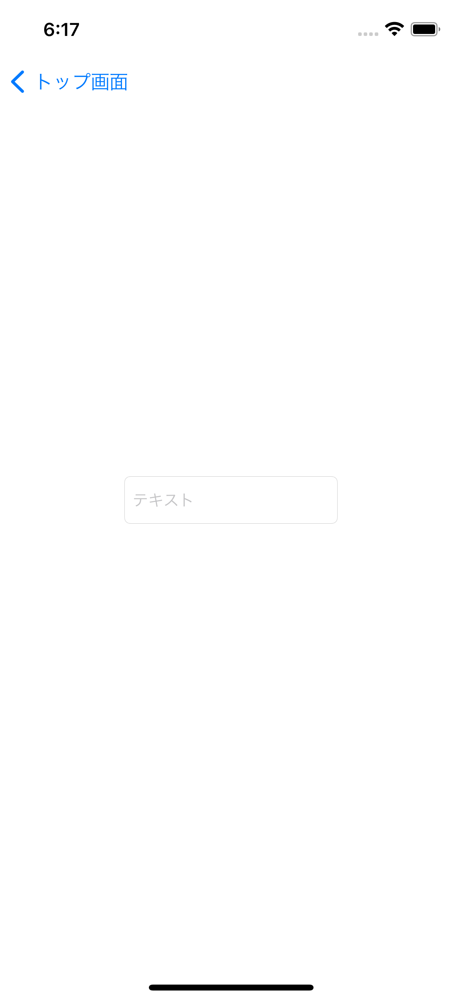
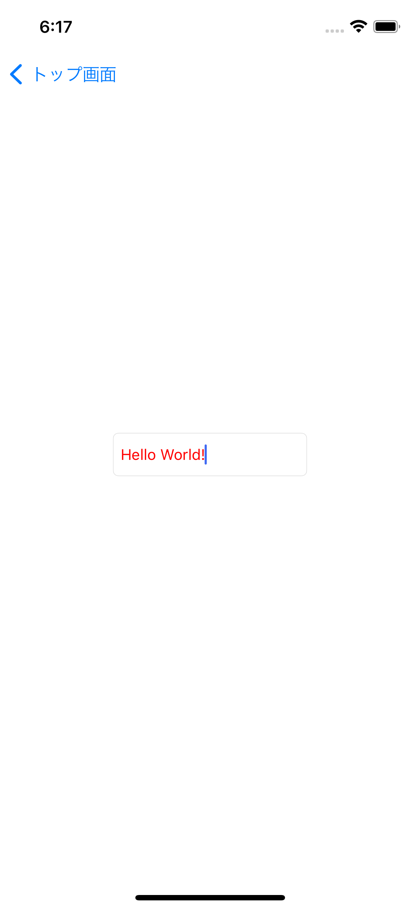

# Chapter1課題

初期画面


## 【TODO1】 StoryboardにUITextField(部品)を配置しよう
`UITextField`とは文字列をユーザーが自由に入力する際に使用する部品です。

例えば、ユーザー登録画面でメールアドレスやパスワードをユーザーに入力してもらうために使用したりされます。

今回はこの`UITextField`について取り扱います。

【やること】

- `ChapterOne.storyboard`に`UITextField`を配置しましょう
  - 制約ルール: 画面中心かつ幅180、高さ40
- ビルドした後に`UITextField`の部品「HelloWorld!」に入力しましょう

※ Simulator上でキーボードは「Shift + Command + K」で表示・非表示できます(ショートカットコマンド)

完成予想図


## 【TODO2】 UITextField(部品)をカスタマイズしてみよう(コード)
Chapter0の【TODO5】で行ったのと同様にコードで`UITextField`をカスタマイズしましょう

【やること】

- `ChapterOne.storyboard`で設置した`UITextField`を`ChapterOneViewController`にアウトレット接続させましょう(名前は「textField」として設定してください)
- アウトレット接続した`UITextField`を使用してコード上でplaceHolderに`テキスト`と設定しましょう
- アウトレット接続した`UITextField`を使用してコード上で文字色を赤色に変更しましょう

<details>

<summary>ヒント</summary>

```swift
final class ChapterOneViewController: UIViewController {
    @IBOutlet var textField: UITextField!

    override func viewDidLoad() {
        super.viewDidLoad()

        textField.placeHolder = 表示したいプレースホルダー
        textField.textColor = 表示したい文字色
    }
}
```

</details>

完成予想図

文字入力前 | 文字入力後
:--: | :--:
 | 

## 【TODO3】 UITextField(部品)のイベントを検知してみよう
`UITextField`にはさまざまなイベントが用意されており、`delegate`という機能を用いてイベントを受け取った際の処理を設定することができます。(`delegate`については`Tutorial.md`の方で説明した内容を再度確認してみてください)

【やること】

- `ChapterOneViewController`に接続した`UITextField`対して`delegate(UITableViewDelegate)`を設定しましょう
- キーボードのReturnキーが押された際に呼ばれる関数を設定しましょう(関数の中に`print("returnが押されました")の処理を含めてください`)

```swift
final class ChapterOneViewController: UIViewController, ???(プロトコルの準拠) {
    @IBOutlet var textField: UITextField!

    override func viewDidLoad() {
        super.viewDidLoad()

        // デリゲートの設定
        textField.delegate = ???
    }

    // returnキーが押された際に呼ばれる処理
    func textFieldShouldReturn(_ textField: UITextField) -> Bool {
        ???
        return true
    }
}
```

完成予想ログ(Returnキーを押した時に出力されるログ)

