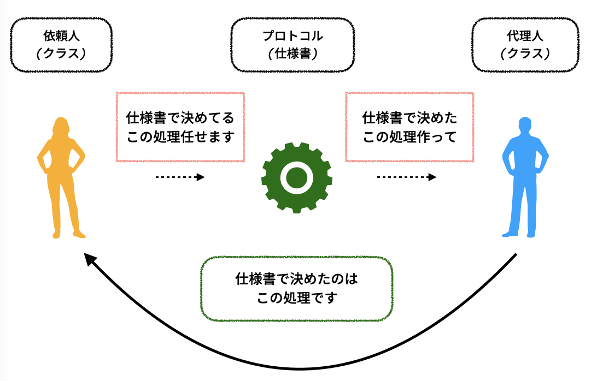
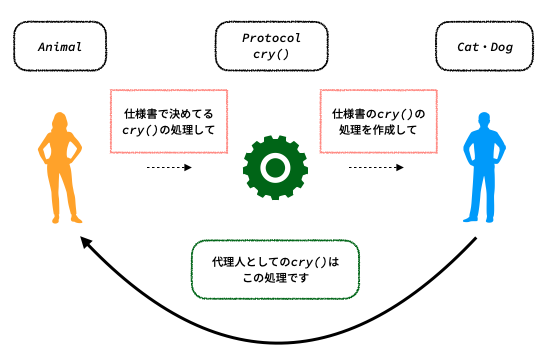
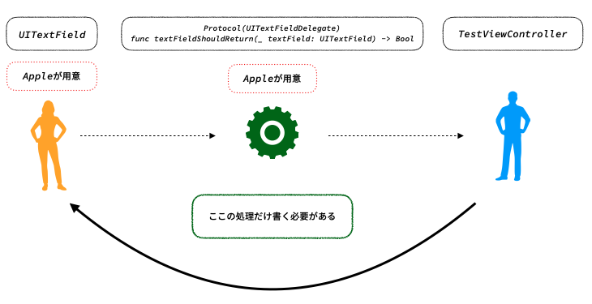

# Chapter1チュートリアル

## 覚えておきたいキーワード

### delegate
「delegate」とはデザインパターンの1種で~~~~と言われますが、Swiftでの「delegate」は「あるクラスは、他のクラスのインスタンスに処理を任せる(委譲する)ことができる」という意味で理解しておけば大丈夫です

#### delegateにおける登場人物
登場するのはたった3人です
1. 処理を依頼する人(依頼人)
2. 処理を依頼される人(代理人)
3. プロトコル(ルール)

※ プロトコル → 設計図(クラス)にこれは絶対設定しなければならない仕様書(ルール)を定めるようなもの



#### delegateの作り方
試しにdelegateがどのようなものなのか作成してみましょう。

```swift
// プロトコルの設定(ここでは関数cry()の定義をします)
protocol AnimalDelegate {
    func cry()
}

class Animal {
    // AnimalDelegateの変数を定義します
    var delegate: AnimalDelegate!

    func animalCry() {
        // delegateに処理を渡します
        delegate.cry()
    }
}

// 「class クラス名: プロトコル」でプロトコルを適用できます
// これを「プロトコルを準拠させる」と呼びます
class Cat: AnimalDelegate {
    func cry() {
        print("ニャー")
    }
}

class Dog: AnimalDelegate {
    func cry() {
        print("ワンワン")
    }
}

let animal1 = Animal()
animal1.delegate = Cat()
animal1.animalCry()

let animal2 = Animal()
animal2.delegate = Dog()
animal2.animalCry()

// 出力結果
// ニャー(定数animal1のanimalCry()の出力結果)
// ワンワン(定数animal2のanimalCry()の出力結果)
```

`Animal`のdelegateに`Cat`のインスタンスを渡した場合は`Cat`の`cry()`が処理として渡され、`Dog`のインスタンスを渡した場合は`Dog`の`cry()`が処理として渡されます。



#### UIKitにおけるdelegate
`UITextField`や`UITableView`といったものは各イベントの処理に対してのdelegateが組み込まれて提供されています。そのため開発者側はプロトコルを作成することなくイベントの中でどういう処理を行うかの代理人の処理を作るだけになります。

例えば、UITextFieldで提供されている「returnキーが押されたときの処理」のイベントを検知できるようにdelegateを設定してみます。

```swift
// 継承・プロトコルは「class クラス名: 継承するクラス, プロトコル」で適用できます
class TestViewController: UIViewController, UITextFieldDelegate {
    @IBOutlet var textField: UITextField!

    override func viewDidLoad() {
        super.viewDidLoad()

        textField.delegate = self // selfはTestViewControllerのインスタンス自身を表します
    }

    func textFieldShouldReturn(_ textField: UITextField) -> Bool {
        print("returnキーが押されたときの処理を記述する場所です")
        return true
    }
}
```

開発者側は`textField`で定義されているdelegateに対して自身のインスタンスを代入するだけで既にApple側で作成されている関数を使用することができます。

Appleから提供されている`UITextField`や`UITableView`はこのようにイベントの処理だけを記載するだけなので、初めは多少混乱するかもしれませんが内部的にもう既に組み込まれているということを知っておけば把握しやすくなるかと思います。

