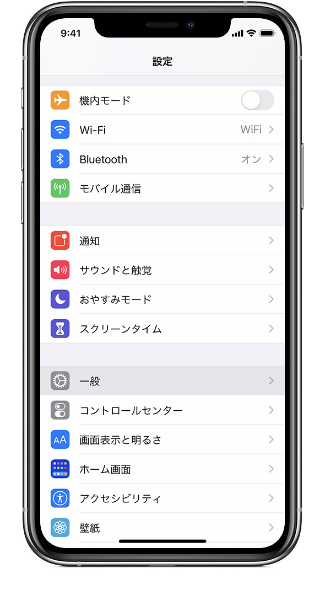
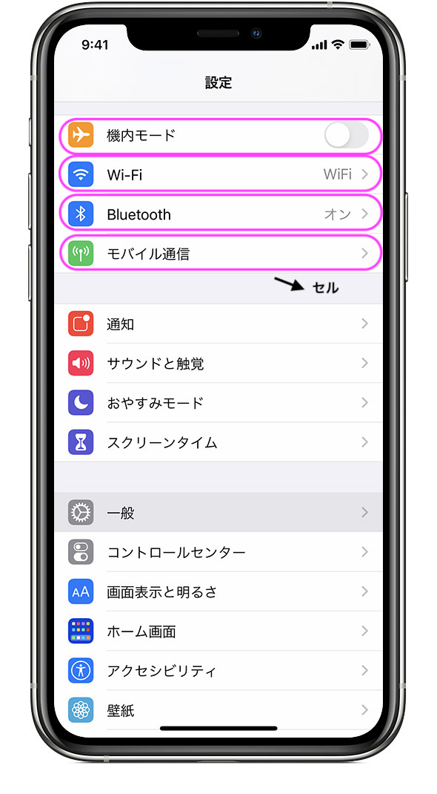
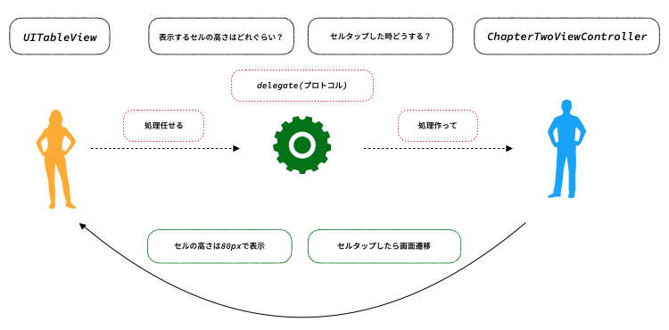
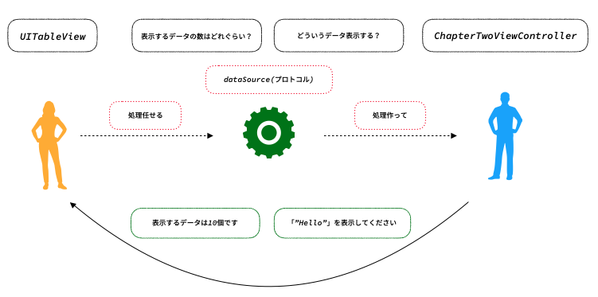
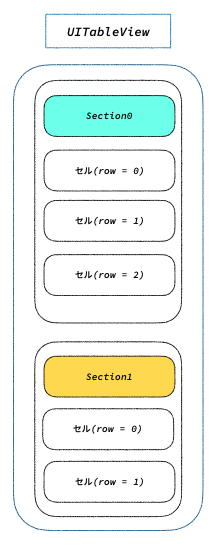

# Chapter2チュートリアル

## 覚えておきたいキーワード

### UITableView
これまでは文字を表示するために`UILabel`や、ボタンでタップイベントを使うために`UIButton`を使用してきましたが、今回は`UITableView`というコンポーネントについて説明します。

`UITableView`は複数のデータをリストとして表示したい場合などに使用できるコンポーネントです。例えば、iPhoneの設定画面などがこれに当てはまります。

`UITableView`でリストとして表示した1つ1つの項目をセルと呼びます。セルは`UITableViewCell`のコンポーネントを用いて作成することができます。

#### delegateとdataSource
`UITableView`にはChapter1で説明したdelegateが採用されています。これらは`delegate`、`dataSource`とそれぞれ命名されています。

`delegate`はプロトコル(仕様書)として`UITableView`の設定(表示)に関する定義がされています。例えば、「表示するセルの高さ」、「セルをタップした際の挙動」などがあります。

`dataSource`はプロトコル(仕様書)として`UITableView`で表示するデータに関する定義がされています。例えば、「表示するデータの数」、「どのようなデータを表示するのか」などがあります。

#### IndexPath
`UITableView`では各セルの情報を判定するために`IndexPath`という情報を持っています。

`IndexPath`では`row`と`section`の変数が用意されており、この2つを使って特定のセルにアクセスします。

この`IndexPath`の情報を使うことで、どのセルをタップしたのかであったり、~~~番目のセルだけ色を変えるのような処理を行うことができます。

