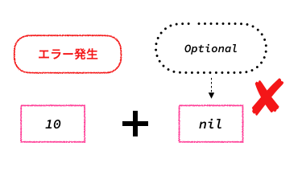

# Swiftとは
2014年にAppleが発表したオープンソースのプログラミング言語です。

主にiOSアプリ開発のために使用されることが多いですが、Webアプリやサービスの開発も行うことができます。

ここではSwiftでの基本構文についてご紹介いたします。

## 定数・変数
Swiftで値を保持するための方法は2種類あり、「定数」と「変数」と呼ばれます。

イメージとしては「値を入れておく箱」と捉えておくと良いかもしれません。


※ 値を箱に入れることを「代入」と呼びます

### 定数
定数は値を一度箱に入れると後から値を変更することができない特徴を持ちます。


定数は`let`キーワードを使用し以下のように記述することで宣言することができます。

```swift
// let 定数名: 型名 = 値
let name: String = "Bob"

// ※ String型は文字列を表す型です
```

宣言した定数の値を変更(再代入)しようとするとコンパイラエラーが出力されます。

``` swift
let name: String = "Bob"
name = "John" // Cannot assign to value: 'name' is a 'let' constant
```

### 変数
変数は値と一度箱に入れても後から値を変更することができる特徴を持ちます。


変数は`var`キーワードを使用し以下のように記述することで宣言することができます。

```swift
// var 変数名: 型名 = 値
var price: Int = 1200

// ※ Int型は数値を表す型です
```

宣言した変数は再代入することができます。

```swift
var price: Int = 1200
price = 700
```

## 型
プログラミングで使用する「データの種類」のことを型と言います。

「りんご」や「みかん」のような文字列データ、「1000」や「-90」のような数値データ、「2022/1/1」といった日付データなどが種類として分けられており、それぞれ名称や特性、扱い方などが定められています。

ここでははじめに基本的な型についてご紹介します。

## String型
String型は文字列を表す型です。

Swiftではダブルクォート(")で囲まれた値を文字列として解釈し、String型として判定されます。


定数にString型を定義する場合は以下のようになります。

```swift
let apple: String = "りんご"
```

### 文字列の結合
文字列と文字列を組み合わせる場合は`+`キーワードを使用します。

```swift
let applePie: String = "アップル" + "パイ"

print(applePie)

// 出力結果
// アップルパイ
//
// ※ print()を使うことでコンソール画面などで値を確認することができます
// 以下のサイトで実際にコードを書いて確認してみましょう
// https://replit.com/languages/swift
```

### 定数・変数の埋め込み
文字列の中に定数・変数を含めたい場合は`\(定数・変数)`の形にすることで、定数・変数に代入されている値に置き換えて文字列に含めることができます。

```swift
let name: String = "山田"

print("こんにちは、\(name)さん")

// 出力結果
// こんにちは、山田さん
```

## 型推論(型の省略)
今まで定数・変数を定義する際に`let or var 定数・変数名: 型 = 値`として記述してきましたが、Swiftは型推論という機能が提供されており、型を明示的に指定しなくても代入された値から型を自動的に推論してくれます。

基本的には積極的に型推論を利用することが推奨されています。

```swift
let name = "太郎" // 自動的にString型として扱われる
```

## 数値型
数値を表す型にはInt型、UInt型、Float型、Double型が提供されています。

## Int型
Int型は整数を表す型です。


Int型にはビット数によってさらに4種類の型が用意されており、以下のように分類されます。

型 | 最小値 | 最大値
:--: | :--: | :--:
Int8 | -128 | 127
Int16 | -32,768 | 32767
Int32 | -2,147,483,648 | 2,147,483,647
Int64 | -9,223,372,036,854,775,808 | 9,223,372,036,854,775,807

定数にInt型を定義する場合は以下のようになります。

```swift
let price: Int = 1000
```

## UInt型
UInt型はマイナス値を含まない0以上の整数を表す型です。


UInt型もInt型と同様にビット数によって4種類の型が用意されています。

型 | 最小値 | 最大値
:--: | :--: | :--:
Int8 | 0 | 255
Int16 | 0 | 65,535
Int32 | 0 | 4,294,967,295
Int64 | 0 | 18,446,744,073,709,551,615

定数にUInt型を定義する場合は以下のようになります。

```swift
let price: UInt = 10000
```

※ Swiftではマイナス値を含まないとわかっていてもUInt型ではなくInt型を使うことが良いとされています。整数に関してはInt型を使用すると統一することで、コードにおける運用性・保守性を高めることができます。

## Float・Double型
Float・Double型は小数点を表す型です。


２つの違いは表現できる値の範囲が異なることで、Float型は10の38乗、Double型は10の308乗までの正負を表すことができます。

定数にFloat、Double型を定義する場合は以下のようになります。
```swift
let float: Float = 1.111
let double: Double = -0.999
```

### 型変換
Swiftは同じ数値であっても型が異なる場合は計算や比較をすることができません。

例えば、Int型の変数にFloat型の値を再代入することはできません。

```swift
var int: Int = 1
var float: Float = 1

int = float // Cannot assign value of type 'Float' to type 'Int'
```


※ 上記の代入をしたい場合はイニシャライザ(初期化)という機能を使用して型を変換させる必要があります。

```swift
var int: Int = 1
var float: Float = 1

int = Int(float) // 型名(値)でイニシャライザを作成できます
```

### 計算
数値型は足し算、引き算、掛け算、割り算といった四則計算、余り計算をすることができます。

```swift
// 足し算
let a = 10 + 10 // 20

// 引き算
let b = 10 - 10 // 0

// 掛け算
let c = 10 * 10 // 100

// 割り算
let d = 10 / 10 // 1

// 余り計算
let e = 10 % 3 // 1
```

### 比較
数値同士の大小関係は比較演算子を使用することで表すことができます。

主な比較演算子は以下のものがあります。

演算子 | 条件
:--: | :--:
「==」 | 左辺と右辺の値が一致するかどうか
「!=」 | 左辺と右辺の値が異なっているかどうか
「>」 | 左辺の値が右辺の値より大きいかどうか
「>=」 | 左辺の値が右辺の値以上かどうか
「<」 | 左辺の値が右辺の値より小さいかどうか
「<=」 | 左辺の値が右辺の値以下かどうか

```swift
print(1 == 1) // true
print(1 != 2) // true
print(2 > 1) // true
print(1 >= 1) // true
print(2 >= 1) // true
print(1 < 2) // true
print(1 <= 1) // true
```

## Bool型
Bool型は真理値を表す型です。

ある命題が真であれば`true`、偽であれば`false`の値が返されます。


定数にBool型を定義する場合は以下のようになります。

```swift
let bool: Bool = true
```

### 否定
否定とは、真理値を逆にする論理演算です。

否定を表す演算子は`!`を値の手前に記述します。

```swift
let bool: Bool = true

print(bool)
print(!bool)

// 出力結果
// true
// false
```

### 論理積、論理和
- 論理積「複数の真理値がすべて真であればtrueを返す論理演算」
  - 論理積を表す演算子「&&」

```swift
let a = 1 == 1 && 2 == 2 // 「1 == 1」, 「2 == 2」はどちらもtrue
print(a)

// 出力結果
// true

let b = 3 == 3 && 4 == 5 // 「3 == 3」はtrueだが「4 == 5」はfalse
print(b)

// 出力結果
// false

let c = 6 == 7 && 8 == 9 // 「6 == 7」、「8 == 9」はどちらもfalse
print(c)

// 出力結果
// false
```

- 論理和「複数の真理値の内、1つでも真があればtrueを返す論理演算」
  - 論理和を表す演算子「||」

```swift
let a = 1 == 1 || 2 == 2 // 「1 == 1」, 「2 == 2」はどちらもtrue
print(a)

// 出力結果
// true

let b = 3 == 3 || 4 == 5 // 「3 == 3」はtrueだが「4 == 5」はfalse
print(b)

// 出力結果
// true

let c = 6 == 7 || 8 == 9 // 「6 == 7」、「8 == 9」はどちらもfalse
print(c)

// 出力結果
// false
```

## Optional型
Swiftでは、値がない状態を`nil`と表しますが、変数では基本的にnilは許容されません。

そのため、例えばString型の変数に`nil`を代入することはできません。

```swift
var apple: String = "りんご"
apple = nil // 'nil' cannot be assigned to type 'String'
```


変数がnilを許容するためにはOptional型にする必要があり、型に対して`?`もしくは`!`を記述します。Optional型では変数の宣言と同時に自動的に`nil`が代入されます。

「何も値が入っていない箱が作られる」、「値が入っている箱を空っぽにする」というイメージです。

```swift
var fruit: String? = "りんご"
fruit = nil

print(fruit)

// 出力結果
// nil

var vegetable: String!
print(vegetable)

// 出力結果
// nil
```


### 値の出力
Optional型で定義した値はOptional用の値となり、通常の値としては出力されません。

例えば、OptionalのInt型の変数を出力してみます。

```swift
var number: Int? = 10
print(number)

// 出力結果
// Optional(10)
```

`Optional(10)`と表示されました。これは通常の数値の`10`とは別物の扱いとなり、計算などをしようとするとエラーが発生します。

```swift
var number1: Int = 10
var number2: Int? = 20

print(number1 + number2) // Value of optional type 'Int?' must be unwrapped to a value of type 'Int'
```


### アンラップ
先ほどOptionalの値と通常の値を同様に扱うことはできないと説明しましたが、Optionalの値を通常の値にして取り出す方法があります。このOptionalの値から通常の値を取り出すことを「アンラップ」と言います。

先ほどの`number2`のオプショナルの値をアンラップして足し算をできるようにしてみましょう。

```swift
var number1: Int = 10
var number2: Int? = 20

print(number1 + number2!)

// 出力結果
// 30
```

変数`number2`の後に`!`を付けることでアンラップしました。これは`Forced Unwrapping(強制的アンラップ)`と呼ばれる方法で、変数にどのような値が入っていてもOptional型を強制的にアンラップします。


強制的アンラップは、変数にnilが入っていた場合はエラーが発生してしまうため取り扱う際には注意が必要です。

```swift
var number1: Int = 10
var number2: Int? = nil

print(number1 + number2!) // Fatal error: Unexpectedly found nil while unwrapping an Optional value
```



強制的アンラップはOptional型の変数の値に関係なくアンラップするため、変数にnilが入っていた場合はエラーが発生してしまう問題がありましたが、この問題を解決する別のアンラップの方法としてオプショナルバインディング(Optional Binding)があります。

オプショナルバインディングは`if文`や`guard文`などの条件式と組み合わせて使うことができます。

先ほど強制的アンラップで取り出した値をオプショナルバインディングを使用して値を取り出すように変更してみましょう。

```swift
var number1: Int = 10
var number2: Int? = 20

if let number2 = number2 {
    print(number1 + number2)
}

// 出力結果
// 30

var number1: Int = 10
var number2: Int? = nil

if let number2 = number2 {
    print(number1 + number2)
}

// 出力結果(出力なし)
```


### オプショナル型(?)と暗黙的アンラップ型(!)の違い
型の後に`?`もしくは`!`を付けることでOptional型にすることができると説明しましたが、`!`で定義したものは暗黙的アンラップ型と呼び、使用するときに必ず強制的アンラップをします。そのため、暗黙的アンラップ型には強制的アンラップを記述する必要はありません。

しかし、暗黙的アンラップ型は強制的アンラップと同様に、変数にnilが入っていた場合はエラーが発生してしまうため取り扱う際には注意が必要です。

```swift
var number1: Int = 10
var number2: Int! = 20

print(number1 + number2)

// 出力結果
// 30

var number1: Int = 10
var number2: Int! = nil

print(number1 + number2) // Fatal error: Unexpectedly found nil while unwrapping an Optional value
```

## Tuple型
Tuple型は複数の型を1つにまとめて扱う型です。


Tupleを使うことで、複数の値を1つのデータとして管理することができます。

変数にTuple型を定義する場合は以下のようになります。

```swift
var tuple: (String, Int, String, Bool) = ("山田", 100, "野球", true)
```

### Tuple要素(値)へのアクセス
タプルにはそれぞれの値にアクセスするための`index`という識別情報(番号)が付けられており、タプルの値は`変数名.index`で取得することができます。


※ `index`は最初の要素(値)を0として順番に数えられます。

```swift
var tuple: (String, Int, String, Bool) = ("山田", 100, "野球", true)

print(tuple.0)
print(tuple.1)
print(tuple.2)
print(tuple.3)

// 出力結果
// 山田
// 100
// 野球
// true
```

### Tuple要素に名前をつける
タプルの要素にはそれぞれ名前を付けることができ、名前を付けた場合はそれを使って要素にアクセスすることができます。

```swift
var tuple: (name: String, age: Int, club: String, isStudent: Bool) = ("山田", 17, "野球", true)
// (型推論を使ってこのように記述することもできます)
// var tuple = (name: "山田", age: 17, club: "野球", isStudent: true)

print(tuple.name)
print(tuple.age)
print(tuple.club)
print(tuple.isStudent)

// 出力結果
// 山田
// 100
// 野球
// true
```

## Void型
Void型は要素の型が0個のTuple型です。


`nil`と似ていますが、`nil`は値が本来値が入っている場所に値がないことを表しているのに対して、Void型はそもそもとして値が存在しないことを表す違いがあります。

Void型は関数の戻り値が必要ない時に使われます。

```swift
func cry() -> Void {
    print("泣く")
}

cry()

// 出力結果
// 泣く
```