# コレクション型
データや値などをまとめて格納するための型としてコレクション型があります。

Swiftでは配列(Array)型、辞書(Dictionary)型、集合(Set)型の3つがコレクション型として提供されており、今回はこちらをご紹介します。

## 配列(Array)型
Array型は同じ型の値を順番に並べたコレクションです。

同じ値を異なる位置に複数配置することも可能です。

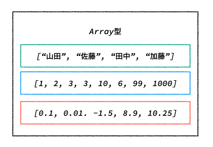

定数にArray型を定義する場合は以下のようになります。

```swift
let names: [String] = ["山田", "佐藤", "田中", "加藤"]
let counts: [Int] = [1, 2, 3, 3, 10, 6, 99, 1000]
let points: [Double] = [0.1, 0.01, -1.5, 8.9, 10.25]

// 以下のように記述することも可能です
let names: Array<String> = ["山田", "佐藤", "田中", "加藤"]
let counts: Array<Int> = [1, 2, 3, 3, 10, 6, 99, 1000]
let points: Array<Double> = [0.1, 0.01, -1.5, 8.9, 10.25]

// 値が空の配列(空配列)も作ることが可能です
let names: [String] = [] // let names = [String]()でも作成できます
```

### 配列要素へのアクセス
配列の要素は`index`を指定することで取得することができます。

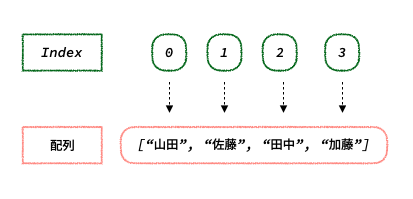

アクセスする方法は`配列[index]`になります。

```swift
let names: [String] = ["山田", "佐藤", "田中", "加藤"]

print(names[0])
print(names[1])
print(names[2])
print(names[3])

// 出力結果
// 山田
// 佐藤
// 田中
// 加藤
```

存在しない`index`を指定して要素にアクセスした場合はエラーになります。

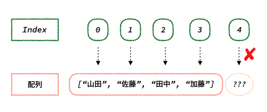

```swift
let names: [String] = ["山田", "佐藤", "田中", "加藤"]

print(names[4]) // Fatal error: Index out of range
```

### 配列要素の更新
配列の要素の更新は、更新する要素の`index`を指定して値を代入することで更新することができます。

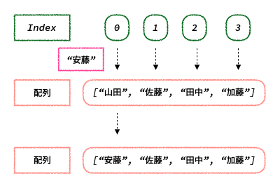

`配列[index] = 値`の記述で値を更新します。

```swift
var names = ["山田", "佐藤", "田中", "加藤"]
names[0] = "安藤"

print(names[0])

// 出力結果
// 安藤
```

### 配列要素の追加
配列に新たに要素を追加する方法は複数あり、以下のような方法があります。

* `append(値)` 配列の末尾に新たに要素を追加します

```swift
var names = ["山田", "佐藤", "田中"]
names.append("吉田")

print(names)

// 出力結果
// ["山田", "佐藤", "田中", "吉田"]
```

配列に別の配列の値を追加したい場合は`append(contentsOf: 配列)`を使用します。

```swift
var names = ["山田", "佐藤", "田中"]
var students = ["伊藤", "浜田"]
names.append(contentsOf: students)

print(names)

// 出力結果
// ["山田", "佐藤", "田中", "伊藤", "浜田"]
```

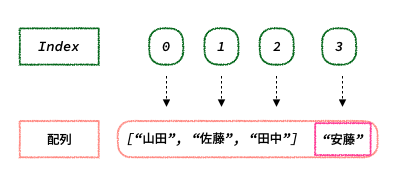

* `insert(値: at: 挿入したい位置のindex)` 配列の任意の位置に新たに要素を追加します

```swift
var animals = ["犬", "猫", "ゾウ"]
animals.insert("パンダ", at: 1)

print(animals)

// 出力結果
// ["犬", "パンダ", "猫", "ゾウ"]
```

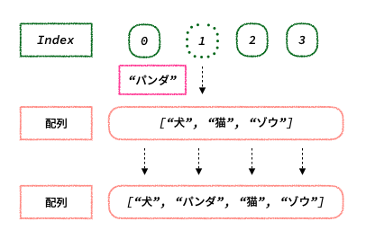

* `+演算子`で結合する

```swift
var number1 = [1, 10, 100]
var number2 = [-1, -10, -100]

print(number1 + number2)

// 出力結果
// [1, 10, 100, -1, -10, -100]
```

### 配列要素の削除
配列から要素を削除する方法も複数あり、以下のような方法があります。

* `remove(at: 削除したい要素のindex)` 指定したindexの要素を削除します

```swift
var names = ["山田", "佐藤", "田中"]
names.remove(at: 2)

print(names)

// 出力結果
// ["山田", 佐藤"]
```

* `removeFirst()` 配列の先頭の要素を削除します

```swift
var names = ["山田", "佐藤", "田中"]
names.removeFirst()

print(names)

// 出力結果
// ["佐藤", "田中"]
```

* `removeLast()` 配列の末尾の要素を削除します

```swift
var names = ["山田", "佐藤", "田中"]
names.removeLast()

print(names)

// 出力結果
// ["山田", "佐藤"]
```

* `removeAll()` 配列の全ての要素を削除します

```swift
var names = ["山田", "佐藤", "田中"]
names.removeAll()

print(names)

// 出力結果
// []
```

### さまざまな配列の操作
配列を操作する方法として、他にもたくさんの処理があります。ここでは一部をご紹介します。

* `count` 配列の要素数を調べる

```swift
var names = ["山田", "佐藤", "田中"]

print(names.count)

// 出力結果
// 3
```

* `isEmpty` 配列が空配列かどうかを調べる

```swift
var array = ["array1", "array2"]
var emptyArray: [String] = []

print(array.isEmpty)
print(emptyArray.isEmpty)

// 出力結果
// false
// true
```

* `shuffle()` 配列の要素をランダムに並び替える

```swift
var names = ["山田", "佐藤", "田中"]
names.shuffle()

print(names)

// 出力結果
// ["佐藤", "山田", "田中"]
```

* `reverse()` 配列の要素を逆にする

```swift
var names = ["山田", "佐藤", "田中"]
names.reverse()

print(names)

// 出力結果
// ["田中", "佐藤", "山田"]
```

## 辞書(Dictionary)型
Dictionary型はキーと値のペアで構成された、順序を持たないコレクションです。

それぞれの値は一意のキーで関連づけられ、キーを辞書内の識別子(配列でいう`index`)として用いられます。

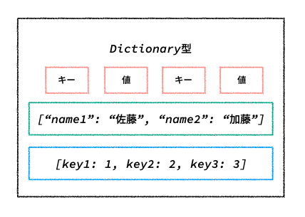

定数にDictionary型を定義する場合は以下のようになります。

```swift
let names: [String: String] = ["name1": "山田", "name2": "佐藤", "name3": "田中"]

// 以下のように記述することも可能です
let names: Dictionary<String, String> = ["name1": "山田", "name2": "佐藤", "name3": "田中"]

// 空の辞書も作ることが可能です
let names: [String: String] = [:] // let names = [String: Stirng]()でも作成できます
```

### 辞書の特徴
* キーは一意にならなければならない

キーは一つの辞書の中で他のキーと被らないようにしなければなりません。同じキーを指定した場合はエラーとなります。

```swift
let names: [String: String] = ["name1": "山田", "name2": "佐藤", "name2": "田中"]

print(names)

// 出力結果
// Fatal error: Dictionary literal contains duplicate keys
```

* 順序関係は保証されない

辞書は配列と違って、繰り返される要素の順番を保証しません。

```swift
let array = [1, 2, 3, 4, 5]
let dictionary = ["key1": 1, "key2": 2, "key3": 3, "key4": 4, "key5": 5]

// forEachで繰り返し処理を行うことができます

array.forEach { element in
    print(element)
}

dictionary.forEach { key, value in
    print(value)
}

// 出力結果
// (array)
// 1
// 2
// 3
// 4
// 5
//
// (dictionary)
// 2
// 4
// 3
// 1
// 5
```

### 辞書の値へのアクセス
辞書の値はキーを指定することで取得することができます。


アクセスする方法は`辞書[キー]`になります。

```swift
let names = ["name1": "佐藤", "name2": "加藤"]

print(names["name1"])

// 出力結果
// Optional("佐藤")
```

存在しないキーを指定して値にアクセスした場合はnilになります。

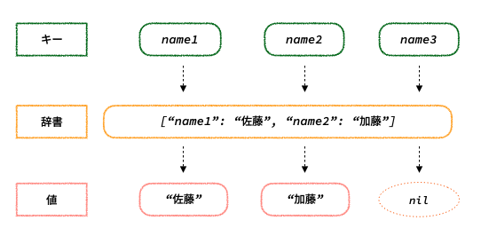

```swift
let names = ["name1": "佐藤", "name2": "加藤"]

print(names["name3"])

// 出力結果
// nil
```

### 辞書の値の更新
辞書の値の更新は、更新する値のキーを指定して値を代入することで更新することができます。

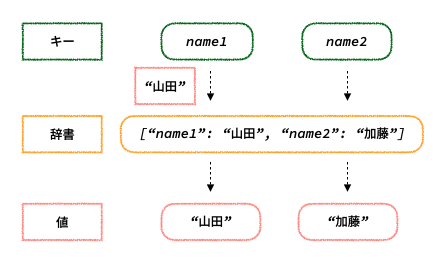

`辞書[キー] = 値`の記述で値を更新します。

```swift
var names = ["name1": "佐藤", "name2": "加藤"]
names["name1"] = "山田"

print(names)

// 出力結果
// ["name1": "山田", "name2": "加藤"]
```

### 辞書の値の追加
辞書の要素を追加するには、追加したい値のキー名を指定して値を代入することで追加することができます。

```swift
var names = ["name1": "佐藤", "name2": "加藤"]
names["name3"] = "山本"

print(names)

// 出力結果
// ["name3": "山本", "name1": "佐藤", "name2": "加藤"]
```

### 辞書の値の削除
辞書の要素を削除するには、削除したい値のキー名を指定して`nil`を代入することで削除することができます。

```swift
var names = ["name1": "佐藤", "name2": "加藤"]
names["name1"] = nil

print(names)

// 出力結果
// ["name2": "加藤"]
```

## 集合(Set)型
Set型は同じ型で一意な値を格納し、順序を持たないコレクションです。

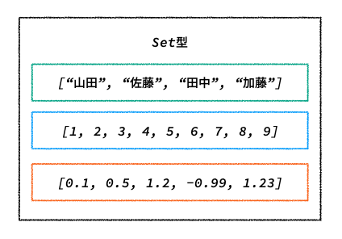

定数にSet型を定義する場合は以下のようになります。

```swift
let names: Set = ["山田", "佐藤", "田中", "加藤"]
let counts: Set = [1, 2, 3, 4, 5, 6, 7, 8, 9]
let points: Set = [0.1, 0.5, 1.2, -0.99, 1.23]

// 以下のように記述することも可能です
let names: Set<String> = ["山田", "佐藤", "田中", "加藤"]
let counts: Set<Int> = [1, 2, 3, 4, 5, 6, 7, 8, 9]
let points: Set<Double> = [0.1, 0.5, 1.2, -0.99, 1.23]

// 値が空の集合(空集合)も作ることが可能です
let names: Set<String> = [] // let names = Set<String>()でも作成できます
```

### 集合の特徴
* 一意な値を格納する

集合は、重複した値を持たないので、同じ値を代入しても格納されません。

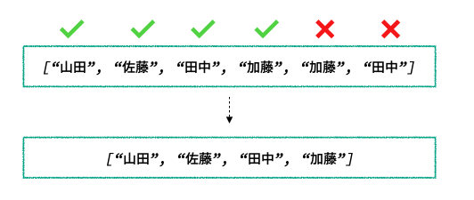

```swift
let names: Set = ["山田", "佐藤", "田中", "加藤", "加藤", "田中"]

print(names)

// 出力結果
// ["佐藤", "加藤", "田中", "山田"]
```

* 順序関係は保証されない

集合は辞書と同じように、繰り返される要素の順番を保証しません。

```swift
let array: [Int] = [1, 2, 3, 4, 5]
let set: Set = [1, 2, 3, 4, 5]

// forEachで繰り返し処理を行うことができます

array.forEach { element in
    print(element)
}

set.forEach { element in
    print(element)
}

// 出力結果
// (array)
// 1
// 2
// 3
// 4
// 5
//
// (set)
// 4
// 5
// 2
// 3
// 1
```

### 集合要素の追加
集合の要素は`insert(値)`を使うことで追加することができます。

```swift
var set: Set = [1, 2, 3, 4, 5]
set.insert(10)

print(set)

// 出力結果
// 1
// 3
// 2
// 5
// 4
// 10
```

### 集合要素の削除
集合の要素は`remove(値)`を使うことで削除することができます。

```swift
var set: Set = [1, 2, 3, 4, 5]
set.remove(3)

print(set)

// 出力結果
// 1
// 2
// 5
// 4
```

### 集合演算
集合演算は要素の集合に対して一定の規則に基づいて演算を行うことができます。

#### 和集合
和集合は`union(集合)`で求めることができます。

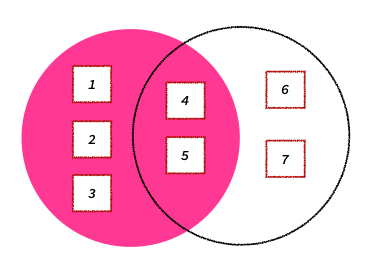

```swift
var set1: Set = [1, 2, 3, 4, 5]
var set2: Set = [4, 5, 6, 7]

set1.union(set2)

print(set1)

// 出力結果
// [2, 5, 1, 3, 4]
```

#### 差集合
差集合は`subtract(集合)`で求めることができます。

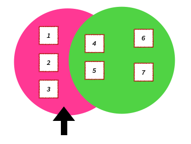

```swift
var set1: Set = [1, 2, 3, 4, 5]
var set2: Set = [4, 5, 6, 7]

set1.subtract(set2)

print(set1)

// 出力結果
// [2, 3, 1]
```

#### 積集合
積集合は`formIntersection(集合)`で求めることができます。

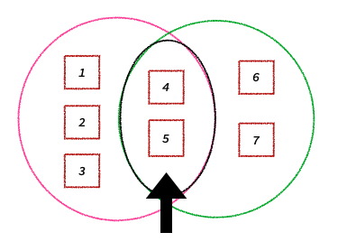

```swift
var set1: Set = [1, 2, 3, 4, 5]
var set2: Set = [4, 5, 6, 7]

set1.formIntersection(set2)

print(set1)

// 出力結果
// [5, 4]
```

## Sequence(シーケンス)
Swiftでは、配列や辞書などのコレクションの全ての要素に対して順番に操作を行なっていくことができるシーケンスという機能が提供されています。

ここでは一部をご紹介します。

### forEach 全ての要素に順番にアクセスする

```swift
let numbers = [1, 2, 3, 4, 5]

numbers.forEach { number in
    print(number)
}

// 出力結果
// 1
// 2
// 3
// 4
// 5
```

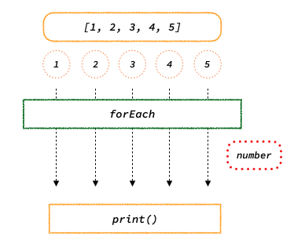

### filter 指定した条件を満たした要素のみを返す

```swift
let numbers = [1, 2, 3, 4, 5]

let filtered = numbers.filter { number in
    number > 2
}

print(filtered)

// 出力結果
// [3, 4, 5]
```

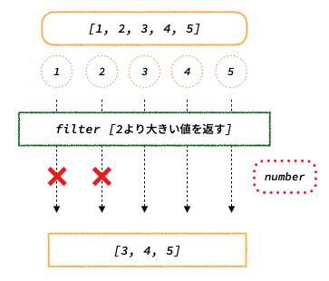

### map 値を元に新たな値を生成して要素を返す

```swift
let numbers = [1, 2, 3, 4, 5]

let mapped = numbers.map { number in
    number * 2
}

print(mapped)

// 出力結果
// [2, 4, 6, 8, 10]
```

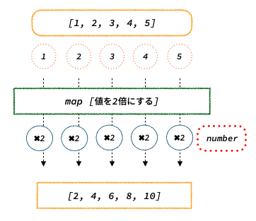

### compactMap nilを排除して値がある要素のみを返す

```swift
let numbers = [1, 2, nil, 4, 5]

let compactMapped = numbers.compactMap { number in
    number
}

print(compactMapped)

// 出力結果
// [1, 2, 4, 5]
```