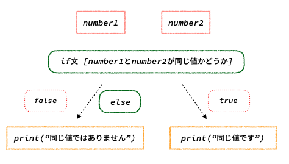

# 条件式
開発していく中で「もしこうだったら〜〜の処理をしたい」、「もし値がnilじゃなかったら処理を進めたい」といった場面に遭遇することは多いかと思います。

Swiftではこうした条件分岐に対してさまざまな方法が提供されており、ここでいくつかご紹介します。

## if文
if文は条件が`true`の場合に処理を実行し、`false`の場合は実行しない条件文です。

```swift
let number1 = 10
let number2 = 10

if number1 == number2 {
    print("number1とnumber2は同じ値です")
}

// 出力結果
// number1とnumber2は同じ値です
```


## else節
if文にelse節を使うと、条件が一致しなかったときの処理を実行することができます。

```swift
let number1 = 10
let number2 = 100

if number1 == number2 {
    print("number1とnumber2は同じ値です")
} else {
    print("number1とnumber2は同じ値ではありません")
}

// 出力結果
// number1とnumber2は同じ値ではありません
```



## if-let文
if-let文はアンラップの際にも登場しましたが、オプショナルバインディングで使用することができます。

Optional型の値に対して、値があれば処理を実行し、値がnilのときは処理を実行しない条件文です。

```swift
let number: Int? = 100

if let number = number {
    print(number)
}

// 出力結果
// 100
```


こちらも同様にelse節も使用できます。

```swift
var number: Int?

if let number = number {
    print(number)
} else {
    print("値はnilでした")
}

// 出力結果
// 値はnilでした
```

複数のOptional型の値を取り出すこともできます。

```swift
var number1: Int? = 10
var number2: Int? = 20
var number3: Int?

if let number1 = number1, let number2 = number2 {
    print(number1)
    print(number2)
}

// 出力結果
// 10
// 20


// 値のどこかにnilがある場合は実行されません
if let number1 = number1, let number3 = number3 {
    print(number1)
    print(number3)
} else {
    print("値のどちらかがnilでした")
}

// 出力結果
// 値のどちらかがnilでした
```

## switch文
switch文は複数の条件を定義し、その条件に応じて処理を実行する条件文です。

```swift
let number = 100

switch number {
case 0..<10: // numberが0から10の場合
    print("値は10以下です")
case 10...100: // numberが10から100の場合
    print("値は10から100です")
default: // 上で定義した「case」のどれにも当てはまらなかった場合
    print("値がわからなくなりました")
}

// 出力結果
// 値は10から100です
```

## guard文
guard文は条件が一致しなかったときに処理を実行する条件文です。

```swift
func getBigNumber(number: Int) {
    guard number > 100 else { // numberが100より大きくなかったらelse節を実行
        print("numberは100以下です")
        return
    }

    print(number)
}

getBigNumber(number: 1000)
getBigNumber(number: 10)

// 出力結果
// 1000
// numberは100以下です
```


# 繰り返し文
Swiftの繰り返し文には`for-in文`, `while文`などがあります。

## for-in文
for-in文は要素を1つずつ取り出しながら繰り返し処理を実行します。

```swift
for number in 1...10 {
    print(number)
}

// 出力結果
// 1
// 2
// 3
// 4
// 5
// 6
// 7
// 8
// 9
// 10
```

## while文
while文は条件式を満たしている間は処理を繰り返し実行します。

```swift
var number = 0

while number < 10 {
    print(number)
    number += 1
}

// 出力結果
// 0
// 1
// 2
// 3
// 4
// 5
// 6
// 7
// 8
// 9
```

## break文
break文は処理を途中で中断させることができます。

```swift
for number in 1...10 {
    if number == 3 {
        break
    }
    print(number)
}

// 出力結果
// 1
// 2
```

## continue文
continue文は処理を途中で中断させて、その次の処理を実行させることができます。

```swift
for number in 1...10 {
    if number == 3 {
        continue
    }
    print(number)
}

// 出力結果
// 1
// 2
// 4
// 5
// 6
// 7
// 8
// 9
// 10
```

# 関数
関数とは、特定の処理を実行するためのコードのまとまりです。今までもコンソールの出力するために`print()`を使ってきましたがこちらも関数になります。

関数は以下の形で記述することができます。

```swift
func 関数名(引数名: 型) -> 戻り値の型 {
    実行する処理
}
```

関数を作成することで、何度も呼び出す可能性のある処理をまとめることができたり、引数を使用することで同じような処理を共通化することができます。

```swift
func test() { // 戻り値の型がVoid型の場合は省略可能です
    print("テストを実行しました")
}

test()

// 出力結果
// テストを実行しました
```

```swift
func getWord(word: String) -> String {
    "文字列の\(word)を取得できました"
}

getWord(word: "りんご")
getWord(word: "ぶどう")
getWord(word: "みかん")

// 出力結果
// 文字列のりんごを取得できました
// 文字列のぶどうを取得できました
// 文字列のみかんを取得できました
```

## 引数
引数には関数を呼び出す際に名前を分かりやすくする外部引数名や、引数の値にデフォルト値を指定するデフォルト引数などのオプションがあります。

### 外部引数名
外部引数名は、引数に名前をつけて呼び出す際に引数の意味が分かりやすいようにする仕組みです。

外部引数名は以下の形で記述することができます。

`func 関数名(外部引数名 引数名: 型) -> 戻り値の型 {}`

```swift
func moveNumber(from number1: Int, to number2: Int) {
    print("\(number1)から\(number2)に動きました")
}

moveNumber(from: 10, to: 100)

// 出力結果
// 10から100に動きました
```

また外部引数名は`_`を使用することで省略することもできます。

```swift
func moveNumber(_ number1: Int, _ number2: Int) {
    print("\(number1)から\(number2)に動きました")
}

moveNumber(100, 1000)

// 出力結果
// 100から1000に動きました
```

### デフォルト引数
引数にはデフォルトの値を指定することができ、呼び出す際に引数を指定しなかった場合はそのデフォルト値を使って処理が行われます。

```swift
func moveNumber(_ number1: Int = 10, _ number2: Int = 100) {
    print("\(number1)から\(number2)に動きました")
}

moveNumber(7, 77)
moveNumber()

// 出力結果
// 7から77に動きました
// 100から1000に動きました
```