# Xcode概要
XcodeはiOSアプリ開発に必要な作業を強力にサポートしてくれるツールです。

ここでは基本的な画面や使い方について簡単にご紹介します。

## 各画面名称
Xcodeの開発エリアについてご紹介します。

こちら大きく5つに分けることができます。

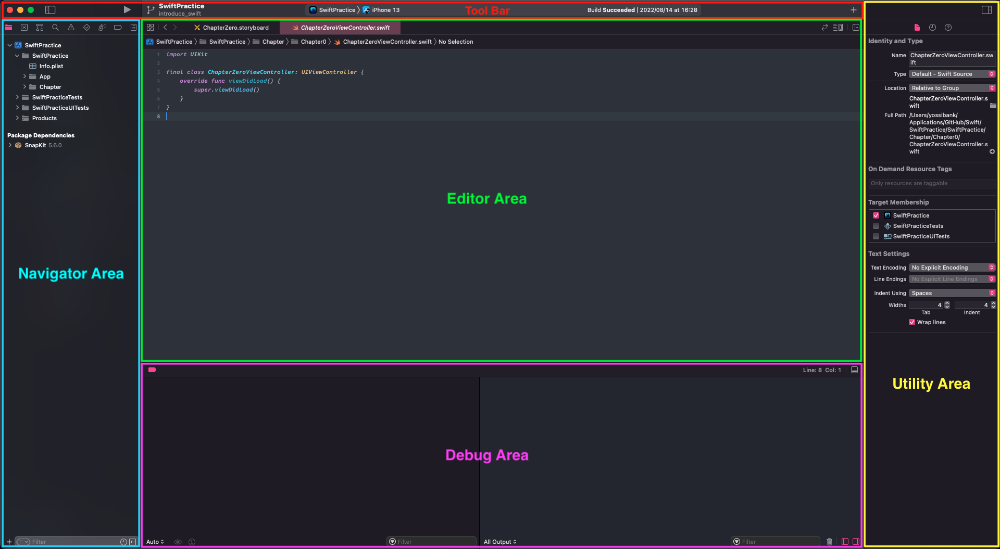

### Navigator Area
ファイルの一覧やプロジェクトの設定、検索などを行うエリアです。

`commnad + 0`で表示・非表示できます(ショートカットコマンド)

ナビゲーターエリアは9つの機能画面を表示できます。

#### Project navigator
アプリファイルの階層構造を表示します。

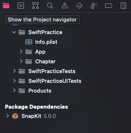

各ファイルをタップすると`Editor Area`に詳細情報が表示されます。

#### Source Control navigator
Gitの管理情報を表示します。

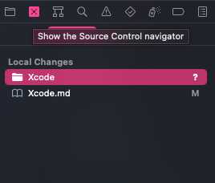

#### Symbol navigator
クラス、構造体で定義している関数。プロパティの一覧を表示します。

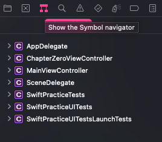

#### Find navigator
検索フォームに文字列を入力し、該当する文字列が含まれるファイルなどを表示します。

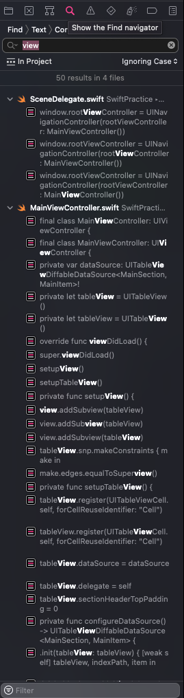

#### Issue navigator
エラー・警告が発生した場合にその内容を表示します。

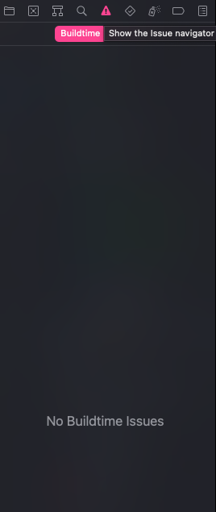

#### Test navigator
定義したテスト一覧・結果を表示します。

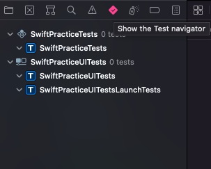

#### Debug navigator
アプリを起動中のデバッグ情報を表示します。

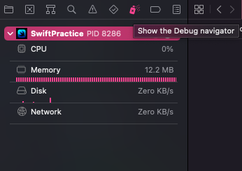

各項目をタップすると`Editor Area`に詳細情報が表示されます。

#### Breakpoint navigator
breakpoint(指定の位置で強制的に処理を一時停止する箇所)を張った一覧を表示します。

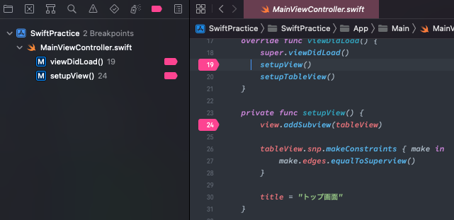

#### Report navigator
ビルド・テスト等を実行した情報が表示されます。

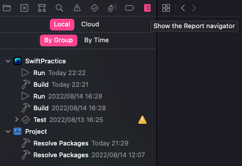

### Editor Area
ファイルの中身を確認・編集などを行うエリアです。

`~~~.swift`のファイルを開くと以下のようなソースコードを編集するファイルが表示されます。

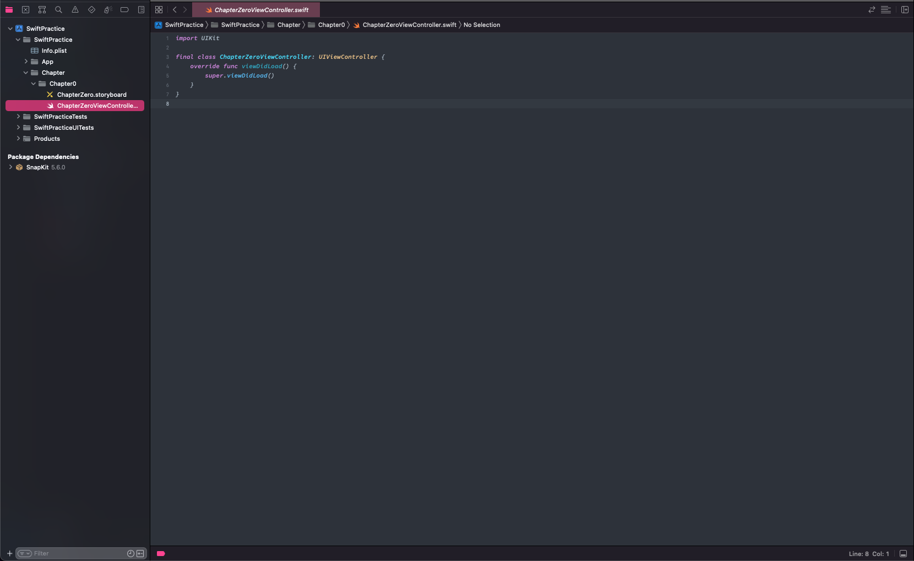

`~~~.storyboard`のファイルを開くと以下のような画面でアプリの画面を視覚的に編集できるファイルが表示されます。

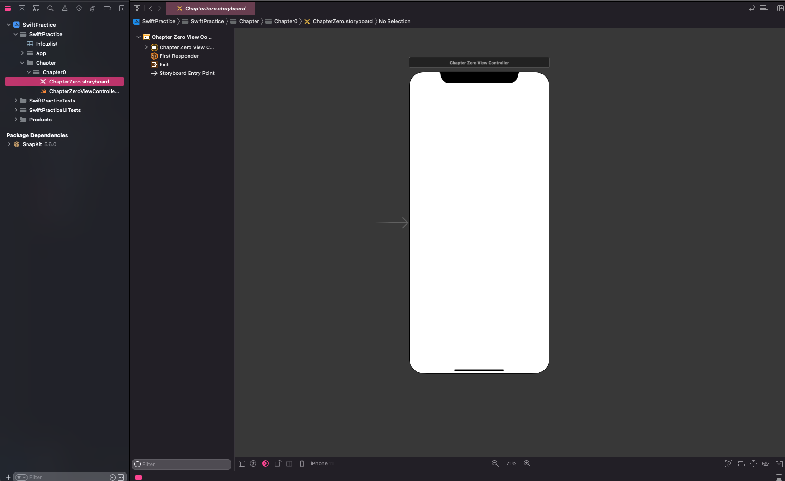

### Utility Area
各ファイルの情報を詳細に表示することのできるエリアです。

`commnad + opiton + 0`で表示・非表示できます(ショートカットコマンド)

`~~~.swift`ではファイル情報や、変更履歴、`~~~.storyboard`ではファイル情報の他にも配置したパーツのカスタマイズを行うことができます。

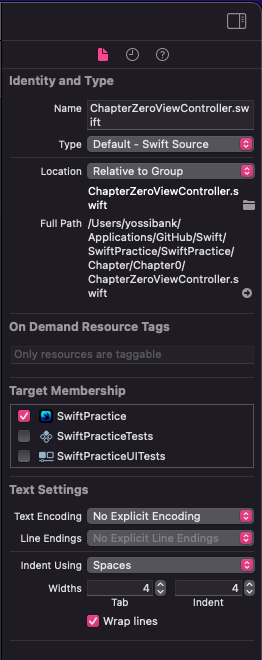

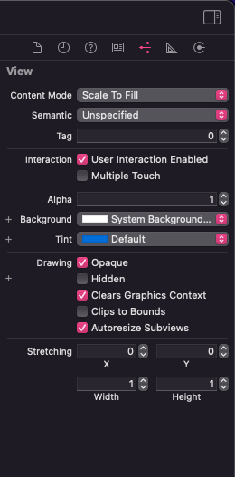

### Debug Area
breakpointで止めた処理で値を出力したい場合や様々なログ出力が表示されるエリアです。

`commnad + opiton + Y`で表示・非表示できます(ショートカットコマンド)

`po`を使用して値を確認できたり、処理を止めた際の情報を表示することもできます。

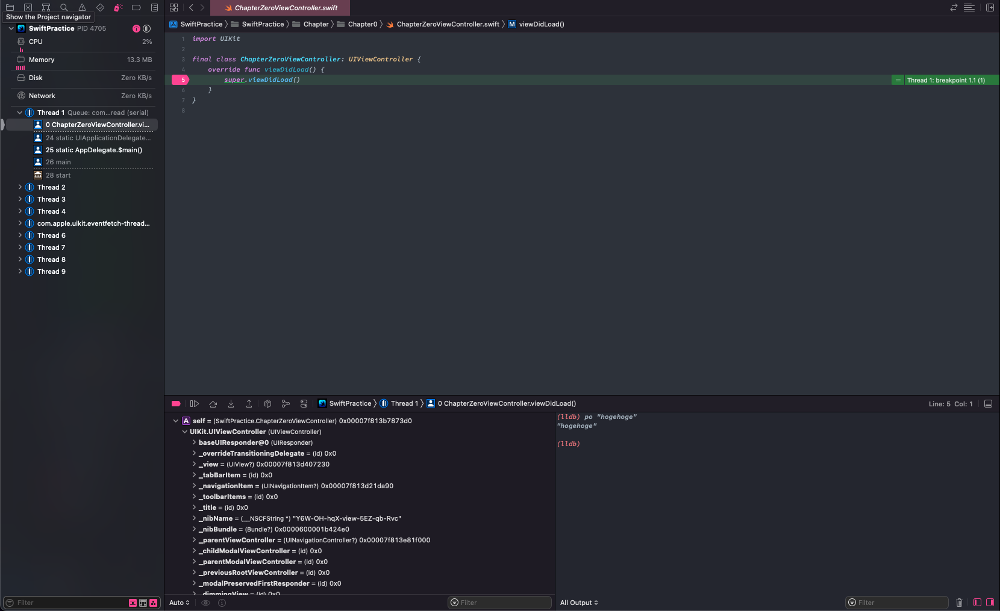